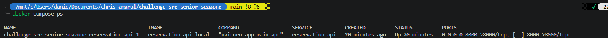
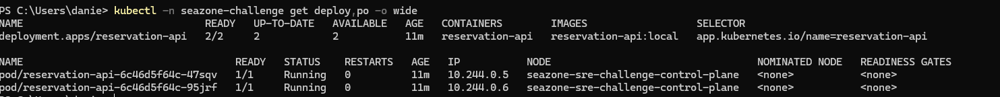
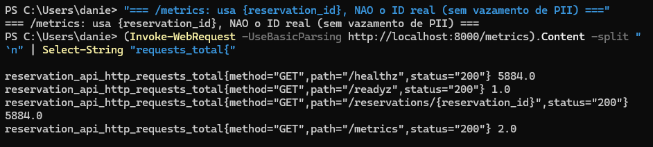
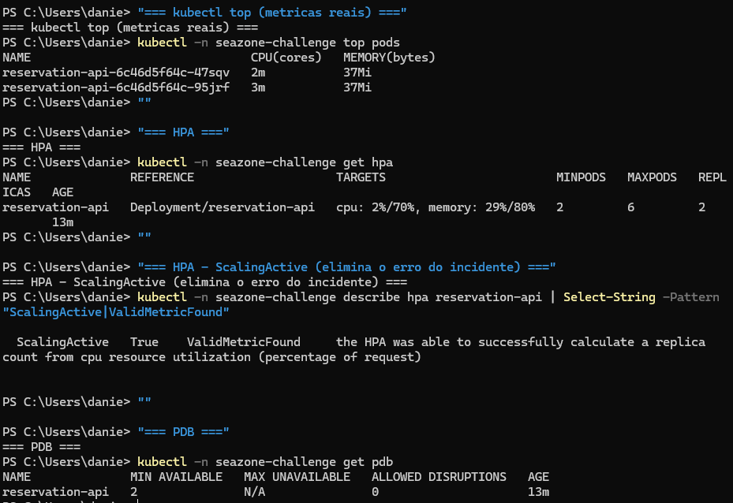
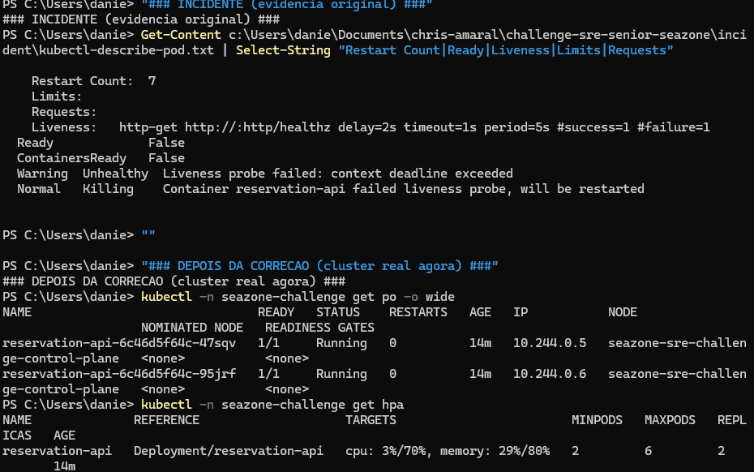

# Solucao Do Desafio — reservation-api

[](https://github.com/chris-amaral/challenge-sre-senior-seazone/actions/workflows/ci.yml)

> Autor: Christopher Amaral | Vaga: Especialista de SRE — Seazone
> Princípio que guia este documento: **DETECTAR → MITIGAR → RESOLVER → DOCUMENTAR**.

## Resumo Executivo

O deploy `1.7.0` do `reservation-api` introduziu **cinco regressões simultâneas** que, juntas,
derrubaram o serviço: probe de liveness com timeout menor que a latência do `/healthz`
(restart loop), readiness apontada para um endpoint lento, timeout de upstream invertido
(`delay > timeout` → 100% de 504), ausência de `requests/limits` (quebrou o HPA) e redução
de 2→1 réplica com rollout sem surge (SPOF + downtime no deploy).

**O que mudou:** corrigi o caminho de confiabilidade no Kubernetes (probes, recursos,
rollout, réplicas), adicionei resiliência (PDB, graceful shutdown, topology spread,
securityContext), defini SLIs/SLO com error budget e alertas por burn rate, endureci o
Terraform-alvo (IRSA, KMS, endpoint privado, node group, logs) e entreguei diferenciais:
pipeline CI com gates de qualidade/segurança, teste de carga k6, runbook e um protótipo de
IA para triagem de incidente.

**Riscos remanescentes (conscientes):** a "dependência upstream" é simulada por `sleep` —
em produção o tratamento correto seria timeout+retry+circuit breaker no cliente; o
ServiceMonitor/PrometheusRule pressupõem Prometheus Operator; e o Terraform é arquitetura-alvo,
**validado mas não aplicado** (conforme as restrições do desafio).

---

## Diagnostico Do Incidente

### Linha do tempo (resumida)

A partir de `incident/timeline.md` e `metrics-snapshot.csv`:

| Horário | Evento | Sinal |
| --- | --- | --- |
| 09:42 | Deploy `1.7.0` | versão muda na métrica |
| 09:45–09:48 | p95 sobe (760ms→2400ms), 5xx 1,2%→8,2% | latência + erro |
| 09:51 | Falhas repetidas de liveness | restart loop |
| 09:53 | Pod único entra em ciclo de restart | `Ready=False` |
| 10:02 | Rollback cogitado, **sem critério documentado** | gap de processo |
| 10:11 | Estabiliza após reduzir tráfego manualmente | mitigação manual |

### Sintomas observados

- HTTP 5xx de ~1% para **8,2%** (`alerts.md`).
- p95 de ~280ms para **3100ms** (`metrics-snapshot.csv`).
- **7 restarts** no pod, `Ready=False` (`kubectl-describe-pod.txt`).
- `context deadline exceeded` em liveness e readiness (`kubectl-events.txt`).
- HPA com `FailedGetResourceMetric: missing request for cpu`.

### Causa raiz (provável) — cinco regressões no `deployment-diff.md`

| # | Mudança | Mecanismo da falha | Como confirmei |
| --- | --- | --- | --- |
| 1 | `HEALTH_LATENCY_MS=1200` + liveness `timeout=1s`/`failureThreshold=1` | `/healthz` demora 1,2s > 1s → probe falha 1x → **kill imediato** → restart loop | `describe-pod` ("context deadline exceeded") + log "health endpoint slower than probe timeout" |
| 2 | readiness `/readyz` → `/healthz` | readiness passa a medir endpoint lento → pod nunca fica `Ready` | `deployment-diff.md` |
| 3 | `UPSTREAM_DELAY_MS=900` > `UPSTREAM_TIMEOUT_MS=800` | `app/main.py` levanta 504 quando `delay > timeout` → **100%** de erro em `/reservations` | `app-logs.jsonl` (timeouts) + leitura do código |
| 4 | `requests/limits` ausentes | HPA não consegue calcular utilização (precisa de `request.cpu`) | `kubectl-events.txt` + `describe-pod` (`<none>`) |
| 5 | `replicas 2→1`, rollout `maxUnavailable:1/maxSurge:0` | único pod fica indisponível no rollout/restart → downtime total | `deployment-diff.md` |

**Causa raiz principal:** #1 e #2 (probes) explicam o restart loop e o `Ready=False`; #3
explica o pico de 5xx. As demais amplificam o impacto.

### Fatores contribuintes (processo, não só config)

- **Alertas sem contexto** — sem versão, runbook ou link de dashboard (`alerts.md`).
- **Sem critério de rollback** documentado (`timeline.md` 10:02).
- **Sem graceful shutdown** — `app-logs.jsonl` mostra 14 requests in-flight perdidos no SIGTERM.

### Hipóteses descartadas

- **Saturação de recursos / OOM:** descartada — `describe-pod` não mostra `OOMKilled`; o RPS
  (~40) está estável; o gargalo é a probe e o timeout, não CPU/memória.
- **Falha de imagem/registry:** descartada — eventos mostram `Pulled`/`Started` normais.

---

## Mitigacao E Prevencao

### Mudanças feitas no repositório

**`k8s/deployment.yaml`** (caminho principal de confiabilidade):

- Liveness em `/healthz` com `timeout 2s` e `failureThreshold 3` (tolera blip); readiness de
  volta em `/readyz`; `startupProbe` isolando o boot.
- `resources.requests/limits` (cpu `100m/500m`, mem `128Mi/256Mi`) — destrava o HPA e dá QoS.
- Env saudável: `HEALTH_LATENCY_MS=0`, `UPSTREAM_DELAY_MS=120 < UPSTREAM_TIMEOUT_MS=1000`.
- `replicas: 3` + rollout `maxUnavailable:0/maxSurge:1` (zero-downtime).
- **Prevenção extra:** `terminationGracePeriodSeconds:30` + `preStop` (drain), `securityContext`
  (runAsNonRoot, readOnlyRootFS, drop ALL caps), `topologySpreadConstraints`.

**`k8s/hpa.yaml`:** `minReplicas:2`, `maxReplicas:6`, `averageUtilization:70`, `behavior`
(anti-flapping). **`k8s/pdb.yaml`:** `minAvailable:2` (protege disrupções voluntárias).

**`infra/terraform`:** IRSA (OIDC provider), KMS para secrets, endpoint privado + público
restrito por CIDR (era `0.0.0.0/0`), logs do control plane, managed node group.

**Observabilidade (`slo/`)**, **CI (`.github/workflows/ci.yml`)**, **k6 (`loadtest/`)**,
**runbook (`docs/`)** e **IA (`ai/incident-triage/`)**.

### Mitigação imediata (o que eu faria no incidente, em minutos)

1. `kubectl rollout undo deploy/reservation-api` — rollback para a revisão estável.
2. Critério objetivo (novo): burn rate > 14,4x após deploy ⇒ rollback primeiro, investiga depois.

### Prevenção de médio prazo

- Gate de CI bloqueante (hoje informativo): manifests sem `requests` ou com probe agressiva
  não passam. **Teria pego o `1.7.0`.**
- Alertas com `runbook_url`/`dashboard` (resolve o gap do `alerts.md`).
- Política de error budget (congela features quando o budget esgota).

### Deixado fora do escopo (por causa do time-box) — e por quê

- **GitOps com ArgoCD / Argo Rollouts (canary):** é a evolução natural do rollout, mas exige
  cluster e repo de manifests dedicados; descrevi na proposta AWS/EKS em vez de implementar.
- **Circuit breaker no cliente do upstream:** a dependência aqui é simulada; em produção eu
  trataria com retry budget + circuit breaker (ex.: via service mesh ou lib).
- **Otimização fina de requests/limits:** os valores são um ponto de partida defensável;
  refinaria com dados reais de produção + k6 (FinOps/rightsizing).

---

## SLI, SLO E Error Budget

Detalhe completo em [`slo/slo.md`](./slo/slo.md). Resumo:

| SLI | Definição | Janela | SLO | Error budget |
| --- | --- | --- | --- | --- |
| Disponibilidade | requests não-5xx / total em `/reservations` | 30d rolling | **99,5%** | 0,5% ≈ **3h36min/mês** |
| Latência | % de requests < 300ms (p95) | 28d rolling | **95%** | — |

- **Instrumentação:** métricas que a API já expõe (`reservation_api_http_requests_total`,
  `..._duration_seconds`), com **route-template** (sem PII no Prometheus — garantido por teste).
- **Alertas:** **burn rate multi-janela** (Google SRE Workbook) em
  [`slo/prometheus-rules.yaml`](./slo/prometheus-rules.yaml) — `FastBurn` (page, >14,4x) e
  `SlowBurn` (ticket, >6x), cada um com `runbook_url` e `dashboard`.
- **Por que burn rate e não "5xx > 2%":** captura tanto o incidente agudo quanto a degradação
  lenta sem alarme-fadiga. No `1.7.0`, 8,2% de 5xx = ~16x o budget → `FastBurn` dispararia em
  minutos com rollback sugerido.

---

## Proposta Para AWS/EKS

Como eu levaria isto para produção (parcialmente já no `infra/terraform`, validado sem aplicar):

- **Cluster e node groups:** EKS gerenciado; managed node groups em subnets privadas (já no TF),
  evoluindo para **Karpenter** para bin-packing e custo. Multi-AZ (2–3 AZs).
- **Rede:** VPC com subnets públicas (só LB) e privadas (nodes); NAT gateway; API server com
  **endpoint privado** + público restrito por allowlist (corrigido — era `0.0.0.0/0`).
- **IAM e IRSA:** OIDC provider (já no TF); cada workload com service account → IAM role de
  menor privilégio. **Zero credencial estática em pod.**
- **Secrets:** **External Secrets Operator** + AWS Secrets Manager; secrets do etcd com **KMS**
  (já no TF). Alinhado ao desligamento do Vault citado na vaga.
- **Observabilidade:** kube-prometheus-stack (Prometheus/Grafana/Alertmanager) + **Loki** para
  logs — exatamente a stack da Seazone. SLOs e dashboards deste repo plugam direto.
- **Deploy, rollback e CI/CD:** **GitOps com ArgoCD**; **Argo Rollouts** para canary com análise
  automática (aborta no burn rate). CI em GitHub Actions com **OIDC** (sem access key), lint,
  `terraform validate`, Trivy/Checkov. Rollback = reverter o commit (auditável).
- **Custos e riscos (FinOps):** rightsizing de requests/limits guiado por k6 + VPA recommender;
  Karpenter + Spot para nodes stateless; tagging por `Project/Environment` (já nos `locals`);
  budgets/anomaly detection no Cost Explorer. Risco principal: endpoint público e ausência de
  node group no estado original — **ambos endereçados**.

> **Observação ao Terraform original:** o estado entregue tinha `endpoint_public_access`
> com `0.0.0.0/0`, sem node group (cluster sem worker), sem IRSA, sem KMS e sem logs de control
> plane. Mantive a arquitetura-alvo e endereçei esses pontos, deixando claros os trade-offs.

**Prior art (referência):** o padrão de GitOps com ArgoCD + Terraform descrito como evolução
natural acima eu mantenho implementado num lab pessoal de Platform Engineering —
[chris-platform](https://github.com/chris-amaral/chris-platform) (Terraform + Kubernetes +
ArgoCD + GitOps) — útil como exemplo concreto dessa arquitetura na prática.

---

## AI Para Reducao De Toil

Protótipo funcional em [`ai/incident-triage/`](./ai/incident-triage/) (roda offline com `--dry-run`).

- **Qual toil:** a correlação manual de 6+ fontes (alerta, events, describe, logs, métricas,
  diff) sob pressão na madrugada — o que atrasou o rollback do `1.7.0` em ~20 min.
- **Quais dados:** apenas as evidências de `incident/`. Nada de banco de produção.
- **Anti-vazamento:** `redact()` mascara `reservation_id`, IPs, emails e segredos **antes** de
  qualquer envio (privacy by design — mesmo princípio das métricas sem PII).
- **Qualidade/alucinação:** system prompt proíbe inventar dados e **exige citação da evidência**;
  uma heurística rule-based roda em paralelo como baseline (divergência = sinal de alerta).
- **Humano no loop:** o agente **só sugere**; nunca executa rollback. `requer_revisao_humana=true`.
- **Métricas de valor:** redução de MTTR, % de causa raiz correta, horas de toil economizadas,
  taxa de falso-positivo. **Evolução:** empacotar como MCP server plugado ao Alertmanager +
  Slack (aprovação humana) — alinhado ao LiteLLM/MCP Hub da Seazone.

---

## Como Validar

Comandos que rodei / que devem ser rodados (sem `terraform apply`, sem recurso AWS real):

```bash
# 1) Testes da API
python3 -m venv .venv && . .venv/bin/activate
pip install -r app/requirements.txt
PYTHONPATH=. pytest app/tests -q              # esperado: 5 passed

# 2) API local
docker compose up --build
curl http://localhost:8000/healthz            # {"status":"ok"}
curl http://localhost:8000/readyz             # {"status":"ready"}
curl http://localhost:8000/reservations/abc   # 200 com env saudavel
curl http://localhost:8000/metrics            # payload Prometheus

# 3) Kubernetes (kind)
make kind-create && make kind-load && make k8s-apply
make k8s-status
kubectl -n seazone-challenge wait --for=condition=ready pod \
  -l app.kubernetes.io/name=reservation-api --timeout=120s   # esperado: pods Ready

# 4) Terraform (valida, NAO aplica)
cd infra/terraform
terraform fmt -check -recursive
terraform init -backend=false
terraform validate                            # esperado: Success!

# 5) Carga (prova o SLO)
k6 run loadtest/k6-script.js                   # thresholds = SLO; verde = SLO sustentado

# 6) IA (offline, sem custo, sem vazar dados)
cd ai/incident-triage && python triage.py --evidence ../../incident --dry-run
```

> **Reprodução do incidente:** subir a API com `UPSTREAM_DELAY_MS=900` e
> `UPSTREAM_TIMEOUT_MS=800` e rodar o k6 — os thresholds falham, provando que os SLIs detectam
> a regressão. Restaurar os valores saudáveis faz o serviço voltar ao verde.

---

## Testes Executados (Evidências Reais)

Todos os passos abaixo foram **efetivamente executados localmente em 2026-06-17** (Docker +
kind, sem `terraform apply` e sem recurso AWS). Saídas completas em
[`docs/evidencias-testes.md`](./docs/evidencias-testes.md). Resumo:

| # | Teste | Resultado |
| --- | --- | --- |
| 1 | `pytest app/tests -q` | ✅ **5 passed** |
| 2 | Endpoints via Docker (`/healthz`, `/readyz`, `/reservations`, `/metrics`) | ✅ 200; métrica usa `path="/reservations/{reservation_id}"` (**sem PII**) |
| 3 | **Reprodução do incidente** (env do 1.7.0) | ✅ `/reservations` → **504**; `/healthz` em **1236ms** > timeout de 1000ms |
| 4 | `terraform fmt` + `init -backend=false` + `validate` | ✅ fmt OK · **validate Success!** (providers `aws`+`tls`) |
| 5 | **kind**: 3 réplicas pós-correção | ✅ **3/3 Ready, 0 restarts** (vs. 7 restarts e `Ready=False` no incidente) |
| 6 | **HPA** com metrics-server | ✅ `cpu: 2%/70%` · `ScalingActive: True — ValidMetricFound` (**elimina** o `missing request for cpu`) |
| 7 | **PDB** | ✅ `minAvailable 2`, `ALLOWED DISRUPTIONS: 1` |
| 8 | **k6** (50 VUs, 3 min, 10.894 reqs) | ✅ **p95 126,94ms** (<300ms) · **0,00% de falhas** (<0,5%) · checks 100% — **SLO sustentado** |
| 9 | IA de triagem (`--dry-run`) | ✅ heurística identificou as 4 falhas; redação de PII aplicada |

### Capturas de tela

As imagens em alta resolução estão em [`evidencias/`](./evidencias/).

**Figura 1 — API no ar via Docker Compose** (`docker compose ps`): container `Up`, porta `8000` exposta.



**Figura 2 — Pods saudáveis no kind** (`kubectl get deploy,po`): pods `Running`, **0 restarts**, `READY 1/1`.



**Figura 3 — Métrica sem PII** (`/metrics`): o caminho aparece como `path="/reservations/{reservation_id}"` — o ID real **nunca** entra na métrica (sem vazamento de PII, sem explosão de cardinalidade).



**Figura 4 — HPA e PDB funcionando** (`top` + `get hpa` + `describe hpa` + `get pdb`):
`cpu: 2%/70%`, `ScalingActive: True / ValidMetricFound` e PDB com `MIN AVAILABLE 2`.



> **Por que aparecem 2 pods (e não 3) nos prints — comportamento esperado:** o Deployment
> sobe com `replicas: 3`, mas, assim que o metrics-server passa a reportar CPU em ~2% (muito
> abaixo do alvo de 70%), o **HPA escala para `minReplicas: 2`**. Ou seja, os prints capturam
> o HPA **ativamente gerenciando** a frota — evidência de que o autoscaling, que estava
> quebrado no incidente (`missing request for cpu`), agora funciona de ponta a ponta.

**Figura 5 — Antes × Depois (mesmo cenário, no kind):** à esquerda a evidência original do
incidente (`Restart Count: 7`, `Ready=False`, sem `Limits/Requests`); à direita o estado
após a correção (`Running`, `0` restarts, HPA com métricas).



| Métrica | Incidente `1.7.0` | Após a correção |
| --- | --- | --- |
| Pods prontos | `Ready=False` | **Running 1/1** (3 no rollout → 2 por HPA) |
| Restarts | 7 | **0** |
| HPA | `FailedGetResourceMetric: missing request for cpu` | `ScalingActive: True` (`cpu 2%/70%`) |
| `/reservations` | 504 (delay>timeout) | 200 |
| 5xx sob carga | 8,2% | **0,00%** |
| p95 | 3100ms | **126,94ms** |
